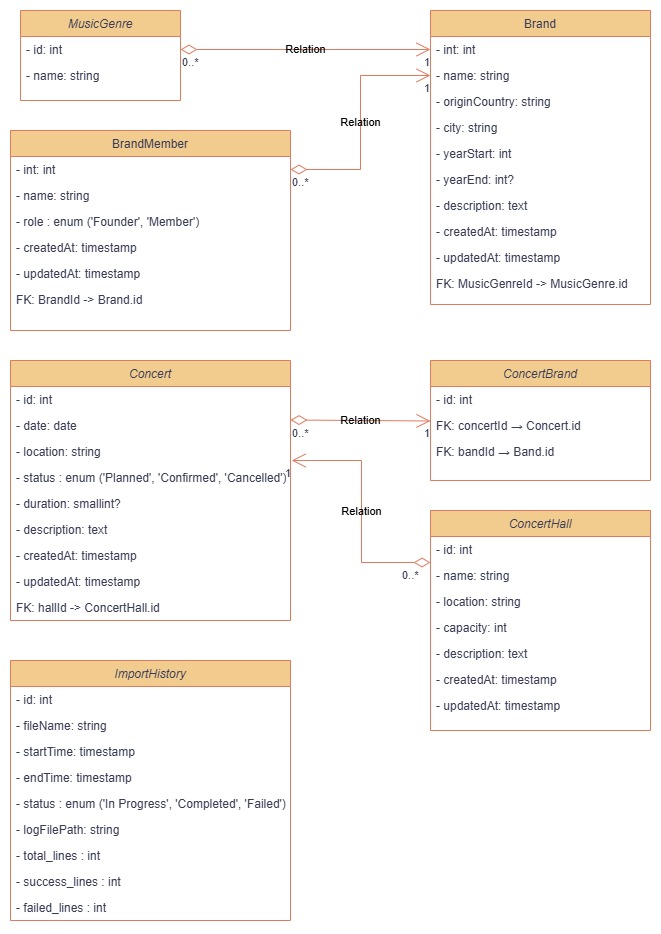

# 🎵 Music Band Management System  

## 📌 Overview  
The **Music Band Management System** is designed to efficiently manage music bands, their members, concert venues, and performances. The system provides a structured approach to organizing concerts, tracking band histories, and importing key data seamlessly.  

## 🏗️ Architecture & Key Entities  

### 🎼 **MusicGenre**  
- Defines different music genres (e.g., Rock, Jazz, Pop).  
- Linked to multiple bands.  

### 🎸 **Band**  
- Represents a music band with attributes such as **name, origin, and music genre**.  

### 👤 **BandMember**  
- Associates members with bands, differentiating between **founders and regular members**.  

### 🏛️ **ConcertHall**  
- Represents concert venues with **location and capacity details**.  

### 🎤 **Concert**  
- Stores concert event details, linked to a concert hall.  
- Includes **status, duration, and participating bands**.  

### 🔄 **ConcertBand**  
- Many-to-Many relationship between **Bands and Concerts** (a band can perform in multiple concerts, and a concert can host multiple bands).  

### 📥 **ImportHistory**  
- Tracks **file imports**, storing logs, statuses, and file paths for auditing.  

## 🎯 UML Key & Notation  

- **Class Representation**: Each entity is represented as a **rectangle** with attributes.  
- **Relationships**:  
  - **1 → 0..*** (One-to-Many): A single entity is linked to multiple others.  
  - **0..* ↔ 0..*** (Many-to-Many): Two entities share multiple associations.  
- **Composition (◆)**: Strong dependency (e.g., a **BandMember** cannot exist without a **Band**).  
- **Aggregation (◇)**: Weaker association (e.g., a **Concert** occurs in a **ConcertHall**, but the hall exists independently).  

## 🏛️ Architecture Flow  

- **MusicGenre** `(1 → 0..* Band)`  
  - A band belongs to **one** genre, but a genre can have **multiple bands**.  

- **Band** `(1 → 0..* BandMember)`  
  - A band consists of **multiple members** (founders & regular members).  

- **ConcertHall** `(1 → 0..* Concert)`  
  - A concert is held in a **specific hall**.  

- **Concert** `(0..* ↔ 0..* Band)`  
  - A concert can feature **multiple bands**, and a band can perform in **multiple concerts**.  

- **ImportHistory**  
  - Tracks **import logs, statuses, and file paths** for auditing and data consistency.  

---

🚀 **This system lays the foundation for scalable and efficient band & concert management!**  
🎶 Feel free to contribute or suggest improvements!  

---
## 📌 Class Diagram  

---